# Integral-X Marketplace Integration Monorepo

Enterprise-grade, scalable microservices architecture for integrating major marketplaces using Node.js, TypeScript, GraphQL, REST, Kafka, Postgres, Docker, and Kubernetes.

[](https://github.com/integral-x/integral-x-monorepo)
[](https://github.com/integral-x/integral-x-monorepo)
[](https://github.com/integral-x/integral-x-monorepo)
[](https://github.com/integral-x/integral-x-monorepo)

---

## 🚀 Quick Start

### Prerequisites

- **Node.js 20+** (LTS recommended)
- **Yarn** (preferred package manager)
- **Docker & Docker Compose** (for containerized development)

### 1. Clone and Setup

```bash
git clone https://github.com/integral-x/integral-x-monorepo.git
cd integral-x-monorepo
yarn install
```

### 2. Start Development Environment

```bash
# Start all services with Docker (recommended)
docker-compose up --build

# Or test the complete setup
./test-docker-setup.sh
```

### 3. Verify Services

- **API Gateway**: http://localhost:4000/health
- **eBay Service**: http://localhost:4100/health
- **GraphQL Playground**: http://localhost:4000/graphql

---

## 🏗️ Architecture Overview

### System Architecture



```
      ┌─────────────────┐
      │   Frontend App  │
      │  (React, etc.)  │
      └─────────┬───────┘
                │ GraphQL
                ▼
      ┌─────────────────┐
      │   API Gateway   │
      │ (NestJS/GraphQL)│
      └─────────┬───────┘
                │
          ┌─────┼─────┐
          ▼     ▼     ▼
      ┌─────┐ ┌─────┐ ┌─────┐
      │eBay │ │Amzn*│ │ ... │
      │Svc  │ │Svc  │ │Svc  │
      └──┬──┘ └──┬──┘ └──┬──┘
         ▼       ▼       ▼
      ┌─────┐ ┌─────┐ ┌─────┐
      │PG/  │ │PG/  │ │PG/  │
      │ebay │ │amzn │ │...  │
      └─────┘ └─────┘ └─────┘
```

**Infrastructure Components:**

- **Kafka**: Event-driven communication
- **Redis**: Caching and session storage
- **PostgreSQL**: Data persistence (schema-per-service)
- **Prometheus**: Metrics collection
- **Jaeger**: Distributed tracing

### Data Flow

1. **Frontend** → GraphQL queries → **API Gateway**
2. **API Gateway** → Kafka events → **Microservices**
3. **Microservices** → Cache (Redis) → Database (Postgres) → External APIs
4. **Response** flows back through the same path with caching

---

## 🛠️ Development

### Available Commands

```bash
# Code Quality (runs license headers, linting, formatting)
yarn spotless

# Build all projects
yarn build:all

# Test all projects
yarn test:all

# Individual project commands
npx nx build api-gateway
npx nx lint ebay-service
npx nx test @integral-x/messaging

# Docker development
docker-compose up --build    # Start all services
docker-compose logs -f       # View logs
docker-compose down          # Stop services
```

### Environment Configuration

#### API Gateway (`.env`)

```bash
NODE_ENV=development
PORT=4000
JWT_SECRET=your-strong-secret-here
OTEL_SERVICE_NAME=api-gateway
JAEGER_HOST=localhost
JAEGER_PORT=6832
KAFKA_BROKERS=kafka:9092
KAFKA_CLIENT_ID=api-gateway
```

#### eBay Service (`.env`)

```bash
NODE_ENV=development
PORT=4100
DB_HOST=postgres
DB_PORT=5432
DB_USER=postgres
DB_PASS=postgres
DB_NAME=postgres
DB_SCHEMA=ebay
KAFKA_BROKERS=kafka:9092
KAFKA_CLIENT_ID=ebay-service
REDIS_HOST=redis
REDIS_PORT=6379
REDIS_CACHE_TTL_SECONDS=3600
EBAY_API_BASE_URL=https://api.ebay.com
EBAY_API_KEY=mock-api-key
```

### Testing

```bash
# Run all tests
yarn test:all

# Run specific service tests
npx nx test api-gateway
npx nx test ebay-service

# Run e2e tests
cd apps/ebay-service-e2e && npm test

# Test Docker setup
./test-docker-setup.sh
```

---

## 📁 Project Structure

```
integral-x-monorepo/
├── apps/                         # Applications
│   ├── api-gateway/              # GraphQL Gateway (Port 4000)
│   │   ├── src/
│   │   │   ├── graphql/          # GraphQL resolvers & schema
│   │   │   ├── messaging/        # Kafka producers
│   │   │   └── config/           # Configuration
│   │   └── Dockerfile
│   ├── ebay-service/             # eBay Microservice (Port 4100)
│   │   ├── src/
│   │   │   ├── controllers/      # REST endpoints
│   │   │   ├── services/         # Business logic
│   │   │   ├── repositories/     # Data access
│   │   │   ├── kafka/            # Event handling
│   │   │   ├── cache/            # Redis caching
│   │   │   └── external/         # eBay API integration
│   │   └── Dockerfile
│   └── ebay-service-e2e/         # E2E tests (dedicated package)
├── libs/                         # Shared Libraries
│   ├── auth/                     # JWT authentication
│   ├── common/                   # Shared types & utilities
│   ├── messaging/                # Kafka utilities
│   └── observability/            # Logging, metrics, tracing
├── k8s/                          # Kubernetes manifests
├── tools/                        # Build & utility scripts
├── docker-compose.yml            # Local development
├── BUILD_SYSTEM.md               # Build system documentation
└── test-docker-setup.sh          # Integration test script
```

---

## 🔧 Tech Stack & Architecture Decisions

| Component            | Technology          | Rationale                                             |
| -------------------- | ------------------- | ----------------------------------------------------- |
| **Runtime**          | Node.js 20+         | Performance, ecosystem, TypeScript support            |
| **Language**         | TypeScript          | Type safety, developer experience, maintainability    |
| **API Gateway**      | NestJS + GraphQL    | Modular architecture, schema federation, type safety  |
| **Microservices**    | NestJS + REST       | Enterprise patterns, dependency injection, decorators |
| **Database**         | PostgreSQL          | ACID compliance, schema-per-service isolation         |
| **Caching**          | Redis               | High-performance caching, session storage             |
| **Messaging**        | Apache Kafka        | Event streaming, decoupled architecture               |
| **Observability**    | Prometheus + Jaeger | Metrics collection, distributed tracing               |
| **Containerization** | Docker + Compose    | Consistent environments, easy deployment              |
| **Orchestration**    | Kubernetes          | Production scalability, service mesh ready            |
| **Build System**     | Nx Monorepo         | Code sharing, incremental builds, caching             |
| **Testing**          | Jest + Supertest    | Unit, integration, and e2e testing                    |

---

## 🚀 Key Features

### Core Capabilities

- **Event-Driven Architecture**: Kafka-based async communication
- **Multi-Tier Caching**: Redis → PostgreSQL → External APIs
- **Full Observability**: Logging, metrics, and distributed tracing
- **Enterprise Security**: JWT authentication, rate limiting, CORS
- **Container-Ready**: Docker development and Kubernetes deployment
- **Comprehensive Testing**: Unit, integration, and e2e test suites

### Developer Experience

- **Fast Development**: Hot reload, incremental builds
- **Type Safety**: End-to-end TypeScript coverage
- **Code Quality**: Automated linting, formatting, license headers
- **Modern Tooling**: Nx workspace, ESLint, Prettier
- **Documentation**: Comprehensive README files and inline docs

### Production Ready

- **Scalable**: Horizontal scaling with Kubernetes
- **Resilient**: Circuit breakers, retry logic, health checks
- **Monitorable**: Prometheus metrics, Jaeger tracing
- **CI/CD Ready**: GitHub Actions integration
- **Secure**: Environment-based secrets, security headers

---

## 📖 Additional Documentation

- **[Architecture](ARCHITECTURE.md)**: System design and patterns
- **[API Gateway](apps/api-gateway/README.md)**: GraphQL gateway documentation
- **[eBay Service](apps/ebay-service/README.md)**: Microservice implementation
- **[Kubernetes](k8s/README.md)**: Deployment manifests

---

## 🤝 Contributing

1. **Code Quality**: Run `yarn spotless` before committing
2. **Testing**: Ensure all tests pass with `yarn test:all`
3. **Docker**: Verify Docker builds with `./test-docker-setup.sh`
4. **Documentation**: Update relevant README files for changes

---

## 📄 License

Copyright (c) 2025 Integral-X. All rights reserved.

This software is proprietary and confidential. Unauthorized copying, distribution, or use is strictly prohibited.
